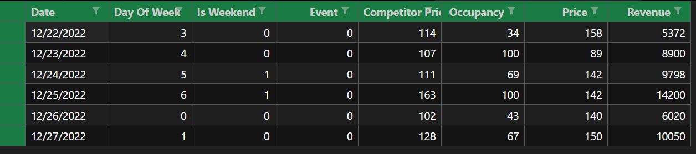

Hotel Revenue Optimization Dashboard
This project is a Streamlit-based web application that uses DataRobot's Prediction API to optimize hotel revenue by predicting occupancy rates and recommending price points for future dates. The application takes historical data as input, forecasts occupancy, and calculates maximum possible revenue.

Features
Upload Historical Data: Users can upload historical data in CSV format.
Automatic Forecast Point: The application determines the last date in the uploaded data as the forecast point for predictions.
Revenue Optimization: Predicts future occupancy and calculates the optimal price point for maximum revenue.
Date Selection: Users can select up to 7 future dates for prediction based on the last date in the historical data.
Dynamic Price Range: Define minimum and maximum price points to explore different pricing strategies.
DataRobot Integration: Leverages DataRobot's Deployment API to make predictions.
Installation
Prerequisites
Python 3.7 or later
Streamlit for the web application
DataRobot account with a deployed model and API access
Install required libraries:
bash
Copy code
pip install -r requirements.txt
Setting Up
Clone the repository:

bash
Copy code
git clone https://github.com/NitishJT/Price_Optimization_Datarobot.git
cd Price_Optimization_Datarobot
Set up a virtual environment (optional but recommended):

bash
Copy code
python -m venv venv
source venv/bin/activate  # On Windows, use venv\Scripts\activate
Install dependencies:

bash
Copy code
pip install -r requirements.txt
Create a .env file in the project root directory and add the following:

dotenv
Copy code
API_URL=https://app.datarobot.com/api/v2/deployments/{deployment_id}/predictions
API_KEY=<your-datarobot-api-key>
DEPLOYMENT_ID=<your-datarobot-deployment-id>
Replace <your-datarobot-api-key> and <your-datarobot-deployment-id> with your DataRobot credentials.

Add sensitive files and directories to .gitignore:

plaintext
Copy code
.env
venv/
input_files/
How It Works
Workflow
Upload Historical Data:

Users upload a CSV file containing historical hotel data.
Required columns: Date, DayOfWeek, IsWeekend, Event, CompetitorPrice, Price, and any other relevant features.
The application preprocesses the data (e.g., filling missing values).
Set Forecast Point:

The last date in the uploaded data is automatically set as the forecast point.
Predictions are made for up to 7 days beyond this point.
Select Prediction Dates:

Users select future dates (up to 7) within the valid range for predictions.
Define Pricing Strategy:

For each selected date, users provide:
Event indicator (0 for no event, 1 for an event)
Minimum and maximum price points
Competitor prices
Predict and Optimize:

The application uses the DataRobot Deployment API to predict occupancy for each price point.
Revenue is calculated as:

Max_Revenue=Predicted Occupancy×Price(Optimal Price)
The optimal price point (maximizing revenue) is identified for each date.
Output Results:

Results, including optimal price and revenue for each date, are displayed in the application.
A CSV file containing the results (final_max_revenue.csv) is saved locally.
Usage
Run the Streamlit application:

bash
Copy code
streamlit run app.py
In the web interface:

Upload a historical data CSV file.
Review the forecast point (last date in the historical data).
Select future dates, define pricing ranges, and provide competitor prices.
Click "Calculate Max Revenue" to view results.
Download the results from the saved CSV file (final_max_revenue.csv).

Example CSV Format
Here is an example format for the historical data file:

Key Files
app.py: Main application code.
.env: Stores API credentials (ignored in version control).
requirements.txt: Contains Python dependencies.
Requirements.txt
Ensure the following libraries are in requirements.txt:

plaintext
Copy code
streamlit
pandas
numpy
requests
python-dotenv
DataRobot API Details
API URL: https://app.datarobot.com/api/v2/deployments/{deployment_id}/predictions
Authorization: Bearer token provided as part of the DataRobot API key.
Request Format:
Historical and future data are combined and sent in CSV format.
The forecast point is specified as a query parameter (forecastPoint).
Troubleshooting
403: Permission Denied: Ensure the correct API key and deployment ID are set in .env.
FileNotFoundError: Ensure the input_files directory exists or is created dynamically by the application.
Prediction Errors: Verify the uploaded CSV matches the required format.
Future Enhancements
Add support for visualizations (e.g., revenue trends).
Improve error handling for API failures.
Extend support for multivariate models using additional features.